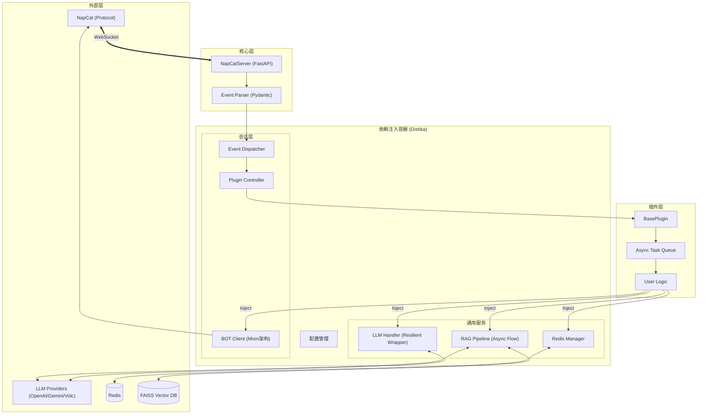

# MyBot

基于 FastAPI 和 NapCat 的 QQ 机器人框架，使用 Python 3.13+ 开发。

本项目主要用于学习和开发 QQ 机器人，集成了依赖注入、插件系统以及 LLM/RAG 等功能。


---

## 🚀 部署 (Docker)

提供构建好的 Docker 镜像，可直接通过 Docker Compose 启动。

### 1. 准备工作

创建必要的目录和配置文件：

```bash
mkdir -p debug logs plugins_config vector
touch setting.toml
```

### 2. 启动服务

创建 `docker-compose.yml`：

```yaml
services:
  mybot:
    image: docker.io/yexi12345/mybotdev:latest
    container_name: mybot
    restart: unless-stopped
    ports:
      - "6055:6055"
    volumes:
      - ./debug:/app/debug
      - ./logs:/app/logs
      - ./plugins_config:/app/plugins_config
      - ./vector:/app/vector
      - ./setting.toml:/app/setting.toml
```

运行：

```bash
docker-compose up -d
```

---

## 💻 本地开发

如需进行插件开发或调试，请参考以下步骤。**注意：本项目仅支持使用 `uv` 进行依赖管理。**

### 1. 环境准备

*   Python 3.13+
*   Redis
*   [NapCat](https://github.com/NapNeko/NapCatQQ)
*   [uv](https://github.com/astral-sh/uv)

### 2. 安装与运行

```bash
# 1. 安装依赖
uv sync

# 2. 配置 setting.toml (参考下方配置说明)
cp setting.example.toml setting.toml  # 如果有示例文件的话，或者手动创建

# 3. 运行
uv run main.py
```

### 配置文件示例 (`setting.toml`)

```toml
faiss_file_location = "./vector"
video_and_image_path = "./logs/media"
password = "YOUR_NAPCAT_TOKEN"  # NapCat Token

[redis_config]
host = "localhost"
port = 6379
db = 0
password = ""

[[llm_settings]]
api_key = "sk-xxxx"
base_url = "https://api.openai.com/v1"
model_vendors = "openai"
provider_type = "openai"

[embedding_settings]
api_key = "sk-xxxx"
provider_type = "siliconflow"
```

---

## 🏗️ 架构说明

### 1. 系统完整架构图



### 2. 处理流程说明

1.  **连接管理**: `NapCatServer` 维护 WebSocket 连接，`Dishka` 为每个连接创建一个独立的 `Scope.SESSION` 容器，确保多账号/多连接之间的数据隔离。
2.  **API 封装**: `BOTClient` 采用 **Mixin 模式** 设计，将 `MessageMixin`, `GroupMixin`, `FileMixin` 等组合成一个完整的客户端对象，提供类型完善的 API 调用。
3.  **LLM 服务**: `LLMHandler` 封装了 `ResilientLLMProvider`，实现了对 OpenAI, Gemini, Volcengine 等多厂商接口的统一调用与错误重试。
4.  **RAG 引擎**: 内置完整的 RAG 流水线：
    *   **Splitter**: 智能文本切分（支持中英文标点优化）。
    *   **TokenBucket**: 基于令牌桶算法的 API 速率限制。
    *   **AsyncPipeline**: 生产者-消费者模式的异步向量化处理。
    *   **FAISS**: 高性能向量检索。
5.  **插件系统**:
    *   **泛型事件**: `BasePlugin[T]` 自动推导订阅事件类型。
    *   **并发模型**: 每个插件实例维护独立的 `asyncio.Queue` 和 Worker 池，互不阻塞。
    *   **安全检查**: 启动时进行静态代码分析（AST），防止插件间循环调用导致死锁。

---

## 📂 项目结构

```
MyBot/
├── app/
│   ├── api/             # QQ 协议 API 封装
│   ├── config/          # 配置定义
│   ├── core/            # 核心组件 (Server, DI, Dispatcher)
│   ├── database/        # 数据库操作
│   ├── models/          # 数据模型 (Pydantic)
│   ├── plugins/         # 插件目录
│   │   ├── base.py      # 插件基类
│   │   └── ...
│   ├── services/        # 业务服务 (LLM, RAG 等)
│   └── utils/           # 工具类
├── main.py              # 入口文件
└── ...
```

---

## 🔌 插件开发

继承 `BasePlugin` 类即可开发插件。

### 1. 基础示例

```python
from app.plugins import BasePlugin
from app.models import GroupMessage

class MyPlugin(BasePlugin[GroupMessage]):
    name = "demo_plugin"
    consumers_count = 1
    priority = 10

    def setup(self) -> None:
        # 初始化逻辑
        pass

    async def run(self, msg: GroupMessage) -> bool:
        if msg.raw_message == "ping":
            # 使用 self.context 调用 API
            await self.context.bot.send_group_msg(
                group_id=msg.group_id,
                message="pong"
            )
            return True
        return False
```

### 2. Context 对象

插件可以通过 `self.context` 访问系统服务：

*   `self.context.bot`: QQ 机器人 API
*   `self.context.llm`: LLM 调用接口
*   `self.context.database`: Redis 操作
*   `self.context.search_vectors`: 向量检索
*   `self.context.settings`: 全局配置

## 📄 License

GPL-3.0 License
