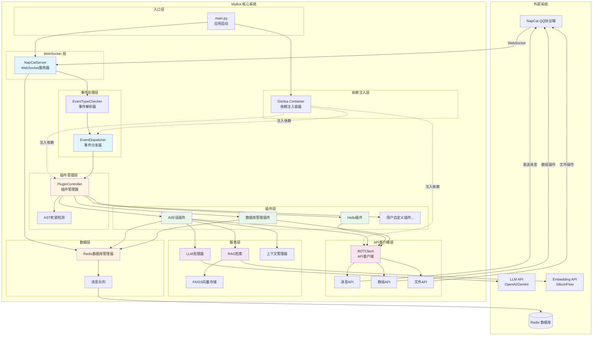
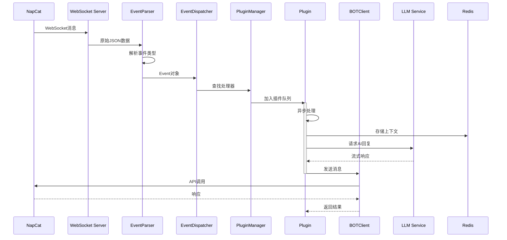
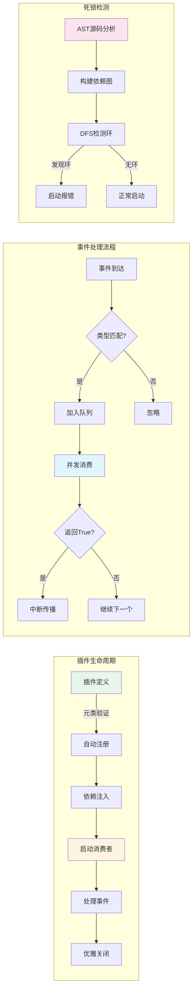

# MyBot - QQ 机器人框架

基于 FastAPI 和 NapCat 的高性能、模块化 QQ 机器人框架，支持插件系统、LLM 集成和 RAG 功能。

## 📋 目录

- [项目架构](#项目架构)
- [核心特性](#核心特性)
- [技术栈](#技术栈)
- [架构详解](#架构详解)
- [快速开始](#快速开始)
- [配置说明](#配置说明)
- [插件开发](#插件开发)

## 🏗️ 项目架构

### 目录结构

```
MyBot/
├── app/                          # 应用主目录
│   ├── api/                      # API 客户端层
│   │   ├── client.py            # BOT API 客户端
│   │   └── mixins/              # API 功能混入
│   │       ├── account.py       # 账号相关 API
│   │       ├── album.py         # 相册相关 API
│   │       ├── file.py          # 文件相关 API
│   │       ├── group.py         # 群组相关 API
│   │       ├── message.py       # 消息相关 API
│   │       └── system.py        # 系统相关 API
│   │
│   ├── core/                     # 核心框架层
│   │   ├── server.py            # WebSocket 服务器
│   │   ├── dispatcher.py        # 事件分发器
│   │   ├── plugin_manager.py   # 插件管理器
│   │   ├── event_parser.py     # 事件解析器
│   │   └── di.py                # 依赖注入容器
│   │
│   ├── database/                 # 数据持久化层
│   │   ├── databasemanager.py  # Redis 数据库管理
│   │   └── schemas.py           # 数据库模型
│   │
│   ├── models/                   # 数据模型层
│   │   ├── segments.py          # 消息段模型
│   │   ├── events/              # 事件模型
│   │   │   ├── message_event.py
│   │   │   ├── notice_event.py
│   │   │   ├── request_event.py
│   │   │   ├── meta_event.py
│   │   │   └── response.py
│   │   └── api/                 # API 数据模型
│   │       └── payloads/        # API 请求载荷
│   │
│   ├── plugins/                  # 插件系统
│   │   ├── base.py              # 插件基类
│   │   └── user_plugins/        # 用户插件
│   │       ├── ai.py            # AI 对话插件
│   │       ├── hello.py         # 示例插件
│   │       └── deldatabase.py   # 数据库管理插件
│   │
│   ├── services/                 # 服务层
│   │   ├── llm/                 # LLM 服务
│   │   │   ├── handler.py       # LLM 处理器
│   │   │   ├── wrapper.py       # LLM 包装器
│   │   │   └── providers/       # LLM 提供商
│   │   │       ├── openai.py
│   │   │       └── gemini.py
│   │   ├── llmcontextmanager/   # LLM 上下文管理
│   │   │   └── context_handler.py
│   │   ├── rag/                 # RAG 检索增强生成
│   │   │   ├── rag_pipeline.py
│   │   │   ├── search_vectors.py
│   │   │   └── providers/
│   │   │       └── client.py    # Embedding 客户端
│   │   └── ai_image/            # AI 图像处理
│   │
│   └── utils/                    # 工具函数层
│       ├── log.py               # 日志工具
│       ├── retry_utils.py       # 重试工具
│       └── utils.py             # 通用工具
│
├── config/                       # 配置管理
│   ├── config.py                # 配置加载器
│   └── schemas.py               # 配置模型
│
├── main.py                       # 应用入口
├── pyproject.toml               # 项目依赖
└── README.md                    # 项目文档
```

### 架构流程图



### 数据流向图



### 插件系统架构



## ✨ 核心特性

- **事件驱动架构**：基于 WebSocket 的实时事件处理
- **插件系统**：灵活的插件机制，支持热插拔和优先级控制
- **依赖注入**：使用 Dishka 实现完整的 DI 容器，支持多层作用域
- **异步处理**：全异步设计，支持高并发消息处理
- **死锁检测**：AST 静态分析自动检测插件间的循环依赖
- **LLM 集成**：支持 OpenAI、Gemini 等多种 LLM 提供商
- **RAG 支持**：向量检索增强生成，提升 AI 响应质量
- **消息队列**：Redis 队列实现消息持久化和顺序处理
- **类型安全**：完整的类型注解和 Pydantic 模型验证

## 🛠️ 技术栈

- **Web 框架**: FastAPI + Uvicorn
- **WebSocket**: websockets
- **依赖注入**: Dishka
- **数据验证**: Pydantic v2
- **数据库**: Redis (异步)
- **LLM**: OpenAI API, Google Gemini
- **向量存储**: FAISS
- **日志**: Loguru
- **HTTP 客户端**: httpx (异步)
- **重试机制**: tenacity
- **图像处理**: Pillow

## 🔍 架构详解

### 1. 核心层 (Core Layer)

#### NapCatServer (`app/core/server.py`)
- **职责**: WebSocket 服务器，处理与 NapCat 的连接
- **功能**:
  - WebSocket 连接管理和鉴权 (Bearer Token)
  - 接收并解析来自 NapCat 的事件数据
  - 将事件分发到 EventDispatcher
  - 管理后台任务和资源清理
  - 生命周期管理（启动/关闭）

#### EventDispatcher (`app/core/dispatcher.py`)
- **职责**: 中央事件分发器
- **功能**:
  - 根据事件类型查找对应的处理器
  - 将事件分发给注册的插件
  - 支持责任链模式（插件返回 True 中断传播）

#### PluginController (`app/core/plugin_manager.py`)
- **职责**: 插件生命周期和依赖管理
- **功能**:
  - 自动加载和注册插件
  - 类型推断：通过检查插件 `run` 方法的参数类型，自动注册事件处理器
  - 内部事件系统：支持插件间通过 `emit/broadcast` 通信
  - **AST 死锁检测**: 静态分析插件源码，检测循环依赖并在启动时报错
  - 事件监听器注册和广播

#### EventTypeChecker (`app/core/event_parser.py`)
- **职责**: 事件类型识别和转换
- **功能**:
  - 将原始 JSON 数据解析为对应的事件对象
  - 支持消息事件、通知事件、请求事件、元事件、响应事件

### 2. 插件系统 (Plugin System)

#### BasePlugin (`app/plugins/base.py`)
- **设计模式**: 模板方法模式 + 元类魔法
- **核心机制**:
  ```python
  class MyPlugin(BasePlugin[MessageEvent]):
      name = "my_plugin"           # 插件唯一标识
      consumers_count = 3          # 并发消费者数量
      priority = 1                 # 优先级（数字越小越优先）
      
      def setup(self):
          # 初始化插件资源
          pass
      
      async def run(self, msg: MessageEvent) -> bool:
          # 处理事件，返回 True 阻止事件继续传播
          return False
  ```

- **特性**:
  - **元类验证**: PluginMeta 在类定义时检查必需属性
  - **异步队列**: 每个插件有独立的任务队列，支持并发处理
  - **Future 模式**: 保证消息按序处理和响应
  - **上下文注入**: 自动注入 LLM、数据库、API 客户端等依赖
  - **事件发射**: `emit()` 方法支持插件间通信
  - **优雅关闭**: `stop_consumers()` 确保任务完成后再退出

#### 插件加载流程
1. 元类 `PluginMeta` 收集所有 `BasePlugin` 子类到 `PLUGINS` 列表
2. `MyProvider.get_plugin_controller()` 实例化所有插件
3. `PluginController` 通过类型推断注册事件处理器
4. 启动时执行 AST 死锁检测

### 3. API 客户端层 (API Client)

#### BOTClient (`app/api/client.py`)
- **设计模式**: Mixin 组合模式
- **组成**:
  ```python
  class BOTClient(
      SystemMixin,      # 系统 API
      AccountMixin,     # 账号 API
      MessageMixin,     # 消息 API
      GroupMixin,       # 群组 API
      FileMixin,        # 文件 API
      AlbumMixin,       # 相册 API
  ):
  ```
- **功能**:
  - 发送各类消息（文本、图片、语音、视频等）
  - 群组管理（踢人、禁言、设置管理员等）
  - 文件操作（上传、下载、转换）
  - 请求-响应匹配：通过 `echo` 字段关联请求和响应

#### Mixin 职责划分
- **MessageMixin**: 发送消息、撤回消息、获取消息历史
- **GroupMixin**: 群组操作、成员管理、设置修改
- **FileMixin**: 文件上传下载、格式转换
- **AccountMixin**: 账号信息、好友列表
- **SystemMixin**: 系统状态、版本信息
- **AlbumMixin**: 相册下载

### 4. 依赖注入 (Dependency Injection)

#### MyProvider (`app/core/di.py`)
使用 Dishka 实现分层作用域：

- **APP 作用域** (应用级单例):
  - Settings: 配置对象
  - LLMHandler: LLM 处理器
  - SearchVectors: 向量检索
  - Redis: 数据库连接
  - RedisDatabaseManager: 数据库管理器

- **SESSION 作用域** (每个 WebSocket 连接):
  - BOTClient: API 客户端（每个连接独立）
  - PluginController: 插件控制器
  - EventDispatcher: 事件分发器

- **优势**:
  - 自动生命周期管理
  - 避免循环依赖
  - 便于测试和 Mock

### 5. 数据持久化 (Database Layer)

#### RedisDatabaseManager (`app/database/databasemanager.py`)
- **功能**:
  - 事件队列：将事件持久化到 Redis 队列
  - 媒体文件管理：下载、转换、存储图片/视频
  - 消费者模式：异步消费队列中的事件
  - 数据清理：定期清理过期数据

- **队列结构**:
  ```
  event_queue:{user_id}:{group_id} -> [事件1, 事件2, ...]
  ```

### 6. 服务层 (Services)

#### LLM 服务 (`app/services/llm/`)
- **LLMHandler**: 统一的 LLM 接口
- **支持的提供商**:
  - OpenAI (GPT-4, GPT-3.5)
  - Google Gemini
- **功能**:
  - 流式响应
  - 上下文管理
  - 图片理解（多模态）
  - 重试机制

#### RAG 服务 (`app/services/rag/`)
- **SearchVectors**: FAISS 向量检索
- **RAGPipeline**: 检索增强生成流程
- **Embedding**: SiliconFlow 文本向量化
- **流程**:
  1. 用户查询 -> 向量化
  2. FAISS 检索相似文档
  3. 构建上下文 -> LLM 生成回答

#### 上下文管理 (`app/services/llmcontextmanager/`)
- **ContextHandler**: 管理对话历史
- **功能**:
  - 加载系统提示词
  - 维护上下文窗口（最大长度限制）
  - 清理过期上下文

### 7. 消息模型 (Models)

#### 事件模型 (`app/models/events/`)
- **MessageEvent**: 消息事件（私聊、群聊、频道）
- **NoticeEvent**: 通知事件（加群、撤回、禁言等）
- **RequestEvent**: 请求事件（加好友、加群）
- **MetaEvent**: 元事件（心跳、生命周期）
- **Response**: API 响应

#### 消息段 (`app/models/segments.py`)
支持的消息类型：
- 文本、表情、图片、语音、视频
- @提及、回复、转发
- JSON、XML、Markdown 等

## 🚀 快速开始

### 环境要求
- Python >= 3.13
- Redis
- NapCat (QQ 机器人协议端)

### 安装依赖
```bash
# 使用 uv（推荐）
uv sync

# 或使用 pip
pip install -r requirements.txt
```

### 配置
创建 `setting.toml` 文件（参考 `setting.toml.example`）：
```toml
[redis_config]
host = "localhost"
port = 6379
db = 0
password = ""

[llm_settings.openai]
api_key = "your-api-key"
base_url = "https://api.openai.com/v1"
model = "gpt-4"

[embedding_settings]
api_key = "your-embedding-api-key"
base_url = "https://api.siliconflow.cn/v1"
```

### 运行
```bash
# Windows
run.bat

# Linux/Mac
python main.py
```

## 📝 配置说明

配置文件使用 TOML 格式，主要配置项：

### Redis 配置
```toml
[redis_config]
host = "localhost"          # Redis 地址
port = 6379                 # Redis 端口
db = 0                      # 数据库编号
password = ""               # 密码（可选）
```

### LLM 配置
```toml
[llm_settings.openai]
api_key = "sk-xxx"
base_url = "https://api.openai.com/v1"
model = "gpt-4"
temperature = 0.7
max_tokens = 2000

[llm_settings.gemini]
api_key = "xxx"
model = "gemini-pro"
```

### RAG 配置
```toml
[embedding_settings]
api_key = "xxx"
base_url = "https://api.siliconflow.cn/v1"
model = "BAAI/bge-large-zh-v1.5"

faiss_file_location = "./vector_store"
```

### 上下文管理
```toml
[llm_context_config]
system_prompt_path = "./prompts/system.txt"
max_context_length = 10
```

## 🔌 插件开发

### 插件模板
```python
from app.plugins import BasePlugin
from app.models import MessageEvent

class MyPlugin(BasePlugin[MessageEvent]):
    name = "my_plugin"          # 必需：插件名称
    consumers_count = 3         # 必需：并发数
    priority = 10               # 必需：优先级
    
    def setup(self):
        """初始化插件（可选）"""
        # 注册内部事件监听器
        self._pending_listeners.append(
            ("some_event", self.on_some_event)
        )
    
    async def run(self, msg: MessageEvent) -> bool:
        """处理消息事件"""
        # 访问依赖
        bot = self.context.bot
        llm = self.context.llm
        db = self.context.database
        
        # 发送消息
        await bot.send_group_msg(
            group_id=msg.group_id,
            message="Hello!"
        )
        
        # 触发内部事件
        await self.emit("some_event", data="xxx")
        
        # 返回 True 阻止事件继续传播
        return False
    
    async def on_some_event(self, kwargs: dict):
        """内部事件处理器"""
        print(kwargs)
```

### 插件上下文
每个插件可访问以下依赖：
- `self.context.bot`: API 客户端
- `self.context.llm`: LLM 处理器
- `self.context.database`: 数据库管理器
- `self.context.search_vectors`: 向量检索
- `self.context.siliconflow`: Embedding 服务
- `self.context.settings`: 配置对象
- `self.context.llm_context_handler`: 上下文管理器

### 事件类型
根据需要处理的事件类型设置泛型参数：
- `BasePlugin[MessageEvent]`: 处理消息事件
- `BasePlugin[NoticeEvent]`: 处理通知事件
- `BasePlugin[RequestEvent]`: 处理请求事件
- `BasePlugin[GroupMessageEvent | PrivateMessageEvent]`: 处理多种事件

### 优先级规则
- 数字越小，优先级越高
- 优先级高的插件先处理事件
- 返回 `True` 可阻止后续插件处理

### 死锁检测
系统会自动检测插件间的循环依赖：
```python
# 错误示例（会在启动时报错）
class PluginA(BasePlugin):
    async def run(self, msg):
        await self.emit("event_b")  # 触发 PluginB

class PluginB(BasePlugin):
    def setup(self):
        self._pending_listeners.append(("event_b", self.on_b))
    
    async def on_b(self, kwargs):
        await self.emit("event_a")  # 触发 PluginA（死锁！）
```

## 📄 许可证

本项目采用 GNU General Public License v3.0 (GPL-3.0) 许可证。

这意味着：
- ✅ 您可以自由使用、修改和分发本软件
- ✅ 您可以将本软件用于商业用途
- ⚠️ 如果您分发本软件或其修改版本，必须：
  - 公开源代码
  - 使用相同的 GPL-3.0 许可证
  - 保留原作者的版权声明
- ⚠️ 本软件不提供任何保证

详细信息请参阅 [LICENSE](LICENSE) 文件或访问 https://www.gnu.org/licenses/gpl-3.0.html

## 🤝 贡献

欢迎提交 Issue 和 Pull Request！

## 📧 联系方式

- GitHub: [https://github.com/yexi-by/MyBot](https://github.com/yexi-by/MyBot)
