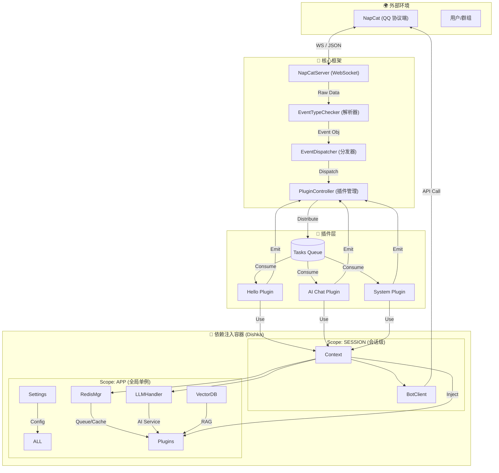
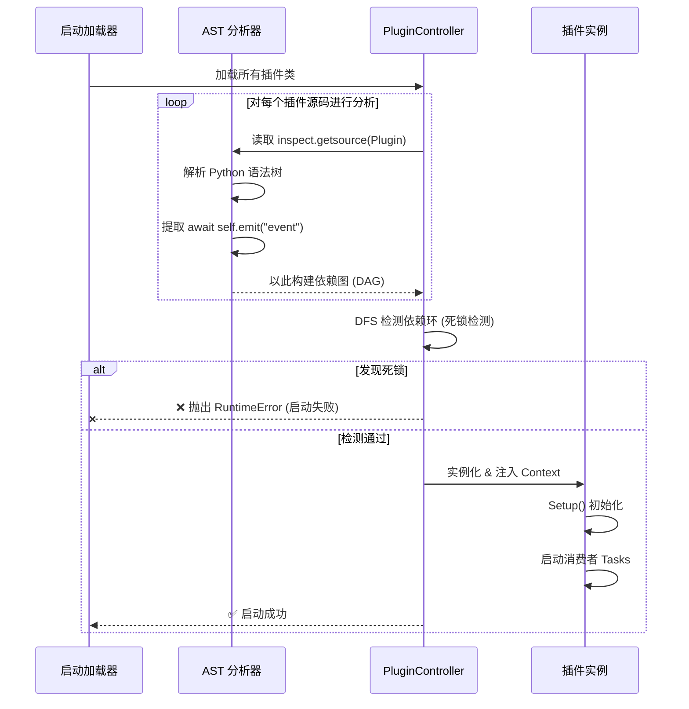

# MyBot 🤖

> 一个基于 **FastAPI** + **NapCat** 的高性能、事件驱动型 QQ 机器人框架。
> 融合了 **Dishka 依赖注入**、**AST 静态死锁检测** 与 **LLM/RAG** 能力。

MyBot 不仅仅是一个聊天机器人，更是一个现代化的 AI Agent 开发平台。它利用最新的 Python 异步特性，提供了稳健的插件系统和强大的服务治理能力。

## ✨ 核心特性

*   **⚡ 极速异步内核**: 基于 FastAPI 和 Uvicorn，全链路异步设计，轻松应对高并发消息。
*   **💉 现代化依赖注入**: 采用 [Dishka](https://github.com/reagento/dishka) 框架，实现清晰的组件解耦和生命周期管理（APP/SESSION 双级作用域）。
*   **🛡️ 智能死锁防护**: 独创的 **AST 静态源码分析**，在启动阶段自动检测插件间的事件循环依赖，防止运行时死锁。
*   **🔌 强大的插件系统**:
    *   **类型安全**: 基于泛型的事件分发，自动推断插件订阅的事件类型。
    *   **并发控制**: 每个插件拥有独立的 `asyncio.Queue` 和消费者池。
    *   **内部总线**: 支持插件间的事件广播与通信 (`emit`/`broadcast`)。
*   **🧠 AI 能力集成**:
    *   开箱即用的 LLM 支持 (OpenAI, Gemini, DeepSeek)。
    *   RAG (检索增强生成) 管道，支持向量数据库 (FAISS) 和 Embedding (SiliconFlow)。
    *   多模态支持 (NovelAI 绘图, 图像识别)。
*   **💾 稳健的数据层**: 内置 Redis 队列缓冲和持久化，确保消息不丢失。

---

## 🏗️ 架构解析

### 1. 系统宏观架构

MyBot 采用层级化设计，通过 Dishka 容器将各个组件有机连接。



### 2. 插件生命周期与死锁检测

MyBot 在启动时会进行严格的代码审查，确保插件间的调用逻辑是安全的。



### 3. 原理解析

*   **NapCatServer**: 维护与 NapCat 的长连接。它不直接处理业务，而是将数据解析为 Pydantic 对象 (`app/models`)，然后“扔”给分发器。
*   **双层依赖注入**:
    *   **APP Scope**: 这一层的对象在整个应用生命周期内只有一个（例如 Redis 连接池、LLM 客户端、配置）。
    *   **SESSION Scope**: 这一层的对象随着每次 WebSocket 连接创建（例如 `BotClient`，因为它绑定了当前的 WS 连接）。这确保了多机器人连接时的隔离性。
*   **AST 死锁检测**: 这是一个独特的功能。在 Python 动态加载插件之前，Controller 会读取插件类的*源代码*，解析抽象语法树 (AST)，寻找 `self.emit("xxx")` 调用。如果发现 `PluginA -> EventA -> PluginB` 且 `PluginB -> EventB -> PluginA` 的闭环，系统会拒绝启动。这比运行时检测更安全。

---

## 📂 项目结构

```
MyBot/
├── app/
│   ├── api/             # 封装 QQ 机器人 API (发送消息, 管理群组等)
│   ├── config/          # 配置文件加载 (Pydantic Models)
│   ├── core/            # 核心逻辑 (Server, Dispatcher, PluginManager, DI)
│   ├── database/        # Redis 数据库交互与持久化
│   ├── models/          # 所有事件和 API 载荷的 Pydantic 定义
│   ├── plugins/         # 插件存放地 (业务逻辑都在这)
│   │   ├── base.py      # 插件基类 (所有插件必须继承它)
│   │   └── ...          # 具体插件
│   ├── services/        # 通用服务 (LLM, RAG, NovelAI 等)
│   └── utils/           # 工具函数
├── plugins_config/      # 插件的特定配置文件
├── main.py              # 启动入口
└── ...
```

---

## 🚀 快速开始

### 1. 环境准备

*   Python 3.12+
*   Redis 服务
*   [NapCat](https://github.com/NapNeko/NapCatQQ) (或其他 OneBot11/Red 协议端)
*   [uv](https://github.com/astral-sh/uv) (推荐) 或 pip

### 2. 安装依赖

```bash
# 使用 uv (推荐)
uv sync

# 或者使用 pip
pip install -r requirements.txt
```

### 3. 配置

在项目根目录创建 `setting.toml` (参考 `app/config/config.py` 中的定义)：

```toml
faiss_file_location = "./data/vector_store"
video_and_image_path = "./data/media"
password = "YOUR_NAPCAT_TOKEN"  # NapCat 的 Access Token

[redis_config]
host = "localhost"
port = 6379
db = 0

[[llm_settings]]
api_key = "sk-xxxx"
base_url = "https://api.openai.com/v1"
model_vendors = "openai"
provider_type = "openai"

[embedding_settings]
# 如果需要 RAG 功能
api_key = "sk-xxxx"
provider_type = "siliconflow"
```

### 4. 运行

```bash
uv run main.py
# 服务将运行在 0.0.0.0:6055
```

---

## 🔌 插件编写教学

MyBot 的插件系统设计得非常直观。只需继承 `BasePlugin` 并指定你要处理的事件类型。

### 1. 最小示例 (Hello World)

创建一个文件 `app/plugins/my_hello.py`:

```python
from app.plugins import BasePlugin
from app.models import GroupMessage  # 导入你想处理的事件类型

class HelloWorldPlugin(BasePlugin[GroupMessage]):
    # 1. 必填元数据
    name = "hello_world"
    consumers_count = 1  # 并发处理的消息数量
    priority = 10        # 优先级 (越小越先执行)

    # 2. 初始化 (可选)
    def setup(self) -> None:
        print("插件已加载！")

    # 3. 核心逻辑
    async def run(self, msg: GroupMessage) -> bool:
        # msg 会被自动解析为 GroupMessage 对象
        
        # 检查消息内容 (这里假设有辅助函数获取纯文本)
        # 注意: 实际消息结构比较复杂，包含 MessageSegment 列表
        raw_text = msg.raw_message 
        
        if raw_text == "你好":
            # 4. 使用 Context 调用能力
            # self.context.bot -> QQ API
            # self.context.llm -> AI 能力
            # self.context.database -> Redis
            
            await self.context.bot.send_group_msg(
                group_id=msg.group_id,
                message="你好呀！我是 MyBot。"
            )
            
            # 返回 True 表示事件已被拦截，不再传给下一个优先级的插件
            # 返回 False 表示继续传递
            return True
            
        return False
```

### 2. 进阶：使用 AI 和 内部事件

```python
class AIPlugin(BasePlugin[GroupMessage]):
    name = "ai_chat"
    consumers_count = 5
    priority = 5

    def setup(self):
        # 注册一个监听器，监听其他插件发出的 "notify_ai" 事件
        self._pending_listeners.append(("notify_ai", self.on_notify))

    async def run(self, msg: GroupMessage) -> bool:
        # 调用 LLM 服务
        if msg.is_at_self: # 假设有这个判断逻辑
            response = await self.context.llm.get_ai_text_response(
                messages=[{"role": "user", "content": "..."}],
                model_name="gpt-4"
            )
            await self.context.bot.send_group_msg(group_id=msg.group_id, message=response)
            
            # 广播事件给其他插件
            await self.emit("ai_replied", content=response)
            return True
        return False

    async def on_notify(self, kwargs: dict):
        print(f"收到通知: {kwargs}")
```

### 3. `Context` 对象能做什么？

在插件中，`self.context` 是你的万能钥匙，它注入了所有你需要的服务：

| 属性 | 类型 | 用途 |
| :--- | :--- | :--- |
| `bot` | `BOTClient` | 调用发送消息、禁言、获取群成员等 QQ API |
| `llm` | `LLMHandler` | 调用大语言模型进行对话或推理 |
| `database` | `RedisDatabaseManager` | 操作 Redis，存取数据或媒体文件 |
| `search_vectors` | `SearchVectors` | 进行向量检索 (RAG) |
| `nai_client` | `NaiClient` | 调用 NovelAI 进行绘图 |
| `settings` | `Settings` | 获取全局配置 |

---


## 📄 许可证

GPL-3.0 License
